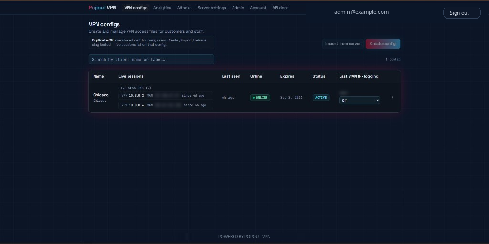
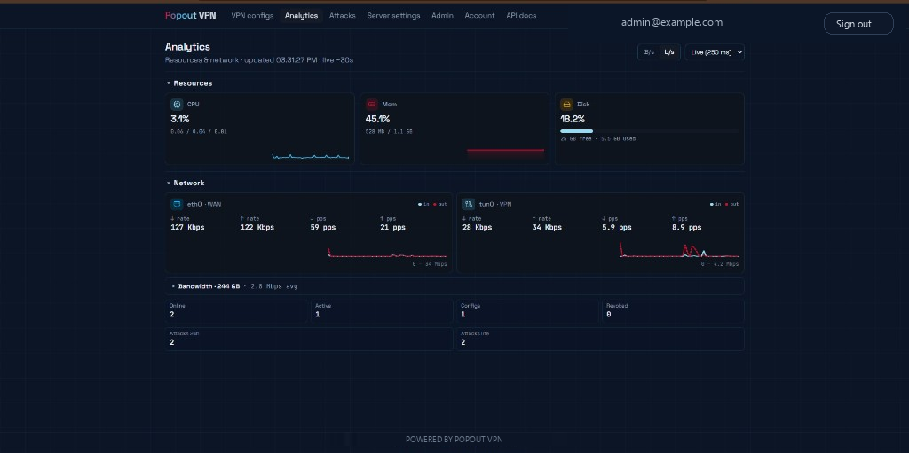
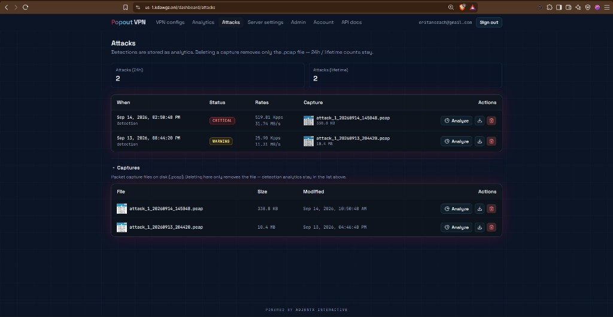
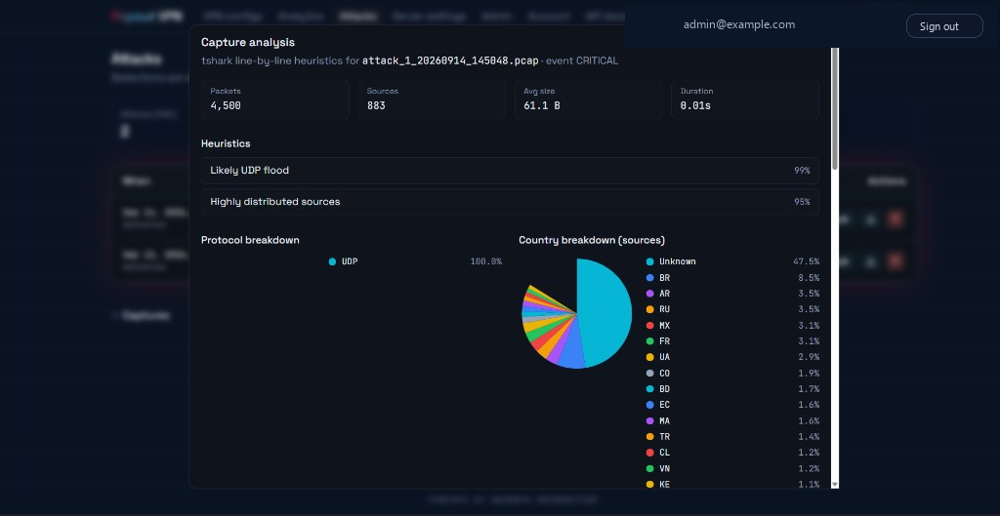
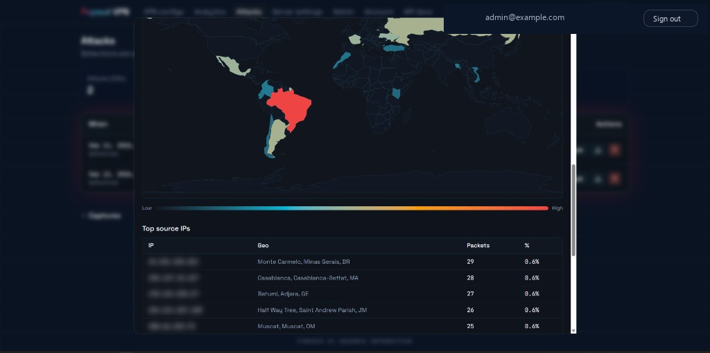
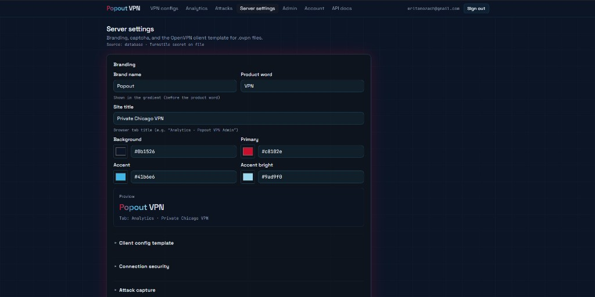
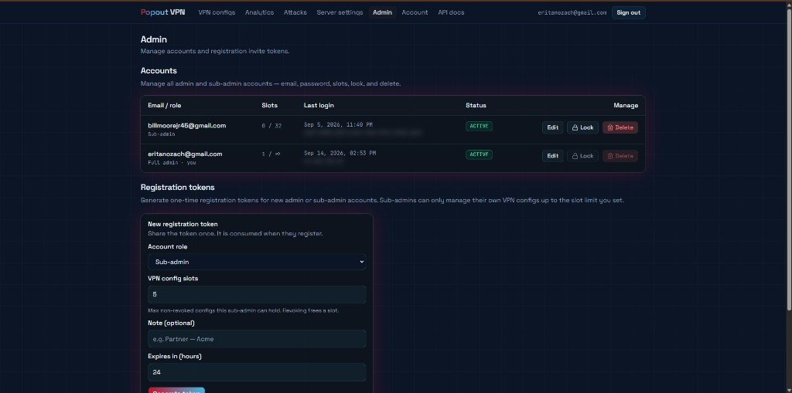

# Popout VPN

<p align="center">
  
</p>

<p align="center">
  <strong>The all-in-one OpenVPN suite.</strong><br/>
  One installer. A real control plane. Optional Cloudflare edge.<br/>
  Open source, self-hosted, built to stay out of your way.
</p>

<p align="center">
  
  
  
  
</p>

Popout VPN is a self-hosted **OpenVPN control plane**: client configs, live connections, analytics, attack capture, traffic shaping, and a dark admin UI. The installer has the **same Linux coverage as [Angristan OpenVPN](https://github.com/angristan/openvpn-install)** — it runs that installer first, then brings up the rest of the stack and prints your login like Pi-hole.

This is **v0.1.0** — a public start. The [roadmap](ROADMAP.md) is real: WireGuard admin, packages, Docker, multi-node. Star the repo if you want that work to stay loud.

---

## Product tour

The panel is a single dark admin: VPN configs, live analytics, attack captures, server policy, and staff accounts. Captions match the nav in the screenshots.

<p align="center">
  <br/>
  <sub><strong>VPN configs.</strong> Issue or import <code>.ovpn</code> files, watch live tunnel sessions (VPN IP + last WAN), expiry, and per-client WAN logging. Duplicate-CN mode is optional when one cert is shared by many seats.</sub>
</p>

<p align="center">
  <br/>
  <sub><strong>Analytics.</strong> Host CPU / memory / disk plus WAN and <code>tun0</code> rates (bits or bytes, live poll). Bandwidth totals, online/active clients, and 24h vs lifetime attack counts stay in one view.</sub>
</p>

<p align="center">
  <br/>
  <sub><strong>Attacks.</strong> Packet-rate threshold detections (warning through critical) with on-disk <code>.pcap</code> files, analyze, download, and delete. Deleting a capture drops the file only — 24h / lifetime analytics remain.</sub>
</p>

<p align="center">
  <br/>
  <sub><strong>Capture analysis.</strong> Open a pcap and Popout runs <code>tshark</code> line-by-line heuristics — not a static IOC / signature database. Labels like “Likely UDP flood” ship with confidence scores, plus protocol mix and source-country breakdown.</sub>
</p>

<p align="center">
  <br/>
  <sub><strong>Source geography.</strong> Heatmap of unique sources from the capture, plus top source IPs with geo and packet share — how “highly distributed sources” shows up on the map.</sub>
</p>

<p align="center">
  <br/>
  <sub><strong>Server settings.</strong> Branding (name, colors, tab title), captcha, the OpenVPN client template, connection security, attack capture, backups, the public hostname gate, and Cloudflare WAF / zone sync.</sub>
</p>

<p align="center">
  <br/>
  <sub><strong>Admin.</strong> Full admins and sub-admins with slot quotas, lock/unlock, and one-time registration tokens (role, slot limit, note, TTL). Sub-admins only see their own configs.</sub>
</p>

---

## What you get

- **OpenVPN that already works** — Angristan’s installer on Debian, Ubuntu, Fedora, Rocky / Alma / CentOS Stream, Amazon Linux, Oracle Linux, and Arch. Existing Nyr layouts are detected.
- **Admin portal** — Next.js + FastAPI. Issue and revoke `.ovpn` files, invite staff, scoped API keys, live sessions.
- **Optional Cloudflare** — yes/no during install. Domain + zone API token (or Global API Key). DNS, SSL Full, cache rules, WAF. **The tunnel is never proxied.**
- **Multiport / knock-style remotes** — ipset `ephemeral-ports` (45000–45099) plus iptables `REDIRECT` to the real OpenVPN port. Clients can advertise `remote-random`.
- **Ops extras** — CAKE shaping on `tun0`, heuristic attack monitor + pcap analysis, zip backups, VPN-only admin on `10.8.0.1`.

After install you get a boxed summary: **admin URL(s), generated email/password, version, and commands** — same idea as Pi-hole’s finish screen.

---

## Attack detection (heuristics)

Popout does **not** ship a classic signature / IOC pack (no “match this exact byte pattern” catalog). Detection is **heuristic**, in two layers:

1. **Live monitor** — samples WAN packet rate (pps / bits). When traffic crosses warning → attack → severe → critical thresholds for long enough, it records an event and optionally captures a `.pcap`.
2. **Capture analysis** — **Analyze** runs `tshark` over that capture and scores traffic shape: protocol mix, TCP flag ratios (SYN / ACK / RST floods), UDP amplification ports, GRE encapsulation, unique source count, and similar signals. Each hit is a label with a **confidence %** (for example *Likely UDP flood · 99%*, *Highly distributed sources · 95%*).

That is intentional for a VPN edge: volumetric floods mutate constantly; heuristics on rate and packet composition stay useful without a constantly updated signature feed. Results are advisory for operators (and Discord embeds if you configure them) — not an automatic blackhole.

Thresholds, retention, and BPF filters are editable under **Server settings → Attack capture**.

---

## Accounts

The first login is generated by the installer (email + random password). That account is a **full admin**. After you sign in, change the password and clear `BOOTSTRAP_ADMIN_PASSWORD` from `config/app.env`.

**Full admin** — everything: configs for the whole box, analytics, attacks, server settings, staff, API keys, Cloudflare.

**Sub-admin** — a partner or staff seat. They get their own login, a **VPN config slot quota** (for example 5 or 32), and they only manage configs they created (or that you assigned). They cannot edit Server settings, other people’s accounts, or attack policy.

**Registration tokens** — one-time invite links from **Admin**. You pick:

- Role (full admin or sub-admin)
- Slot limit for sub-admins (max non-revoked configs; revoking a client frees a slot)
- Optional note (`Partner — Acme`)
- Expiry in hours (default 24)

Share the token once. It is consumed when they register. You can lock or delete accounts later without touching OpenVPN until you revoke their configs.

Browser sessions use short-lived JWTs plus refresh cookies. Full admins stay signed in; sub-admins can opt into “keep signed in.” Login and register are rate-limited per IP and per email.

---

## REST API

Automation uses **`/api/v1`**, not the panel session cookie. Create keys under **Account → API keys** (`pk_live_…`, shown once).

```bash
curl -sS "$BASE/api/v1/health" \
  -H "Authorization: Bearer $API_KEY"
# or: -H "X-Api-Key: $API_KEY"
```

| Scope | What it unlocks |
|---|---|
| `configs:create` | Issue a client and return the `.ovpn` body |
| `configs:revoke` | Soft-revoke or hard-delete |
| `configs:logs` | Connection events for one config |
| `analytics:read` | Host + client overview (sub-admin keys only see their own stats) |
| `settings:write` | Read/patch shaping and selected server knobs (**full-admin keys only**) |

Per-key rate limits (default 60/min) and a minimum analytics interval (default 2.5s) return `429`. The in-app **API docs** tab is the same contract against your live origin.

Full reference: [docs/API.md](docs/API.md).

---

## Optional security

Nothing below is required for a VPN-only box. Turn on what matches how you publish the portal.

**Stay on the tunnel** — bind the admin to `10.8.0.1`, skip Cloudflare. The panel is unreachable from the WAN.

**Cloudflare edge** — orange-cloud the hostname, SSL Full, cache bypass for `/api` and `/dashboard`, WAF (scanners, threat score, hosting ASNs). Valid `/api/v1` keys can be allowlisted at the edge so scripts skip the browser challenges. Optional: nftables so origin `:80`/`:443` only accept [Cloudflare IP ranges](https://www.cloudflare.com/ips/). Details: [docs/CLOUDFLARE.md](docs/CLOUDFLARE.md).

**Public password gate** — a single shared password in front of the Cloudflare hostname (no username). VPN clients on `10.8.0.1` skip it. Useful when the UI is on the internet but you still want a human gate before login.

**Cloudflare Turnstile** — captcha on login/register when the portal is public. Disable it for VPN-only installs.

**WAN IP policy** — log last public IP per session, and optionally cap how many unique WAN IPs a config may use in a window (default 3 / 24h) so a leaked `.ovpn` is harder to share.

**Origin TLS** — self-signed cert is enough for Cloudflare **Full**. Move to Full (strict) later with an Origin CA.

**Auth hardening** — JWT length checks in production, argon2 password hashes, invite-token TTL, API keys encrypted at rest, registration tokens that die after one use.

---

## Install

You need a Linux VPS with a public IPv4, root, and `/dev/net/tun`. **Not Windows. Not macOS.** Same rule as Angristan.

```bash
curl -fsSL https://raw.githubusercontent.com/Adjent-X/popout-vpn/main/install.sh -o popout-vpn-install.sh
sudo bash popout-vpn-install.sh
```

Or clone and run from the tree:

```bash
git clone https://github.com/Adjent-X/popout-vpn.git
cd popout-vpn
sudo bash install.sh
```

The installer will:

1. Detect your distro and install packages (nginx, Node 20, MongoDB, Python, ipset, iptables).
2. **Install OpenVPN via Angristan** if it is not already there (interactive — pick protocol, port, DNS, first client).
3. Ask: **Put the admin portal behind Cloudflare? [y/N]**  
   If yes: apex domain + API token (or Global API Key + email). See [docs/CLOUDFLARE.md](docs/CLOUDFLARE.md).
4. Generate JWT, Mongo password, and the first admin login.
5. Create ipset `ephemeral-ports` and NAT `REDIRECT` to OpenVPN.
6. If Cloudflare was enabled, auto-tune the zone (DNS, SSL, cache, WAF).
7. Print the portal URL and default login.

Connect a client, then open the admin over the tunnel (typically `http://10.8.0.1/`). If you enabled Cloudflare, `https://admin.yourdomain.com` is the public gateway.

Full walkthrough: [docs/INSTALL.md](docs/INSTALL.md).

---

## Cloudflare (yes or no)

Cloudflare fronts the **web UI**, not OpenVPN.

- **Yes** — orange-cloud `admin.<your-domain>`, SSL Full, cache bypass for `/api` and `/dashboard`, long cache for `/_next/static`, WAF rules for scanners and `/api/v1` API keys. Optional: lock origin 80/443 to Cloudflare IP ranges.
- **No** — admin stays on the VPN (`10.8.0.1`). Nothing is published on the WAN.

You will be asked for:

- Apex **domain** (the zone, e.g. `example.com`)
- **API token** with Zone DNS Edit, Zone Settings Edit, Zone Read, Cache Rules Edit, Firewall Services Edit  
  or a **Global API Key** + account email (Cloudflare still calls this an API key)

Token setup is spelled out in [docs/CLOUDFLARE.md](docs/CLOUDFLARE.md). The panel can re-apply the zone later from **Server settings**.

---

## Commands

After install, `popout-vpn` is on your PATH (Angristan-style menu if you run it with no args):

```text
popout-vpn                 Interactive menu
popout-vpn version         0.1.0 + git describe + GitHub URL + API health
popout-vpn env             Current config/app.env (secrets masked)
popout-vpn env --show-secrets
popout-vpn settings        Live Server settings from Mongo
popout-vpn reinstall       Repair panel + firewall + Cloudflare (keeps PKI)
popout-vpn status
popout-vpn uninstall
```

Version tracks the repo `VERSION` file (`0.1.0` today) and `GET /api/health`. Details: [docs/COMMANDS.md](docs/COMMANDS.md).

---

## Architecture

```
                    .ovpn clients
                          |
              +-----------+-----------+
              |  ports 45000-45099    |
              |  ipset ephemeral-ports|
              |  NAT REDIRECT ----+   |
              +-------------------|---+
                                  v
                           OpenVPN :1194
                           tun0 10.8.0.1
                                  |
        browser --(+ Cloudflare)-- nginx --+-- Next.js :3000
                                           +-- FastAPI :8000
                                                    |
                                                 MongoDB
```

More: [docs/ARCHITECTURE.md](docs/ARCHITECTURE.md).

---

## What’s next

v0.1.0 is the public preview. Coming up (see [ROADMAP.md](ROADMAP.md)):

- WireGuard peer admin beside OpenVPN
- Official `.deb` / `.rpm` and a Docker Compose path
- Multi-node / failover
- WebAuthn and passkeys
- Mobile-friendly client download flow

Issues and PRs are welcome. This is meant to be a product, not a private ops dump.

---

## Credits

- [Angristan/openvpn-install](https://github.com/angristan/openvpn-install) — GPL-3.0. We **download and run** that installer; we do not relicense it. Popout VPN itself is MIT.
- Inspired by the Pi-hole installer finish screen (clear URLs, one default password, “you’re done”).

## License

[MIT](LICENSE)

## Security

Please see [SECURITY.md](SECURITY.md). Do not open public issues for unpatched origin or auth bugs.
